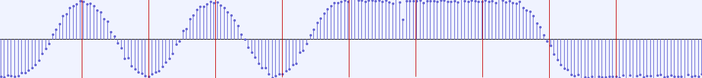
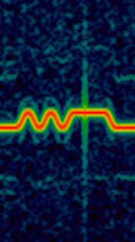
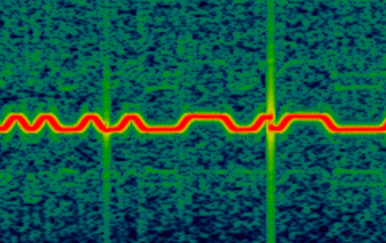

## ShineLink

ShineLink is an apparently deprecated Growatt inverter monitoring standard.

ShineLink-X (modbus over usb?) or ShineLink-S (modbus over serial?) connect to the inverter,
transmit data, and a ShineLanBox receives(?) this data and uploads it to the cloud.

This is different to the ShineLan-X and the ShineWifi-S (and e.g. the 4g variants), as there
is a mysterious link between the ShineLanBox and the ShineLink.

Projects like [grott](https://github.com/johanmeijer/grott) interfere with the cloud communication.

Projects like [OpenInverterGateway](https://github.com/OpenInverterGateway/OpenInverterGateway) replace the firmware
on a ShineWifi-S.

Then there's [growatt-proxy](https://github.com/ehoutsma/Growatt-proxy/blob/d771c0265cdb0bc1d7455ff60fd4810f9fba0df0/extractData.php),
which looks like it reads something like this format, but in a different way?

### hardware

Initially, I had a look at the [hardware](HARDWARE.md) and bus pirated out [one-chat](one-chat/README.md),
which gives a good idea about how the hardware works, but not a very good idea about how the data works.

### this codebase

Then, this codebase came about.

This codebase decodes some packets given some help, enough for me to work out a few things:

1. Pretty confident it's a custom protocol, which just shares structs over the wire.
2. As far as I can tell, the radio link is _very_ unreliable, I believe due to hardware issues,
   or something severely, catastrophically wrong with everything I have ever done.
3. The data resolution or frequency is not significantly above what the app offers.
4. There's no security, you chat to anyone's inverter having seen any packet.

### decode pipeline

- [rtl-sdr-snipper](https://github.com/FauxFaux/rtl-sdr-snipper) monitors the approximate frequency (around 434.2MHz)
- [squelcher](src/bin/squelcher.rs) processes a `cu8` radio capture into multiple `f32` "fm" demodulations, one per packet
- [decode](src/bin/decode.rs) reads an `f32` file and tries to synchronise, clock recover, decode, decrypt and checksum the packets

Or, in one go:

- [perfect-packets](src/bin/perfect-packets.rs) reads a directory of `cu8`s and saves `{source}.{packet-type}.pkt` dumps of all recognised packets.

### general protocol structure

Packets are:
 * "RF"
 * sequence number, doesn't appear to be used for anything
 * 2 bytes of nonsense, probably protocol version
 * serial of the ShineLanBox and the ShineLink-X/S in ascii
 * packet type, 1 byte (maybe two bytes including the \0 below)
 * \0
 * data, pre-determined length
 * crc16/modbus checksum

The transaction goes:

 * ShineLanBox sends a packet with the data type it wants, and the data set to `0x01 0x00` (?)
 * ShineLink-X/S responds with a packet of the same type, with the data set to the requested data,
   sometimes(?) multiple times (for reliability?)
 * end

### packet type 172

The most interesting packet is type `172`, examples in
[172/](172). [parse-172](src/parse/172.rs) is an attempt at parsing them:

```text
2025-07-17T22_43_19.17023.pkt:
4:    2405
7:      17
10:  -1394   these are probably "active energy"
13:   4224    / "reactive energy" as the app calls them in the debug menu
16:  -3172
19:   -336
22:  -1394
23:   4224
24:  -3172
25:   -336
26:    499    probably grid frequency, 49.9
31:   3785    these four are increasing, probably kWh since some date
33:   1046    ... but they don't seem to line up with the app numbers in magnitude
35:   3805
36:   1046
```

The gaps are probably related to 3-phase (i.e. we're getting zeros for phases except the first).

To further interpret this, you'd need data from various times and correlations with the app data.
Or just to look at what `grott` does when it receives these packets.

### other packets

Noting that short packets are more likely to be decoded.

- `60` (short, 65% of captured packets) has just the serial number of the inverter in, and space for multiple other serials
- `33` (short, 3% of captured packets) is just the serial number again, and the date in local time (e.g. `2025-07-19 14:43:19`).
- `14` (short, 3% of captured packets) contains just four bytes, two of which are zero. Some flags?
- `13` (short, 2% of captured packets) contains just three bytes, two of which are zero. Some flags?
- `156` (long, <1% of captured packets) contains a bunch of metadata, hardware versions, standards(?), install date, ?

25% are the previously discussed `172` packets, which come every five minutes (BOOOO), or probable errors.

### hardware issues

Recovering the clock appears to be very difficult. You can have an apparently strong signal,
but will see very poorly clocked data.

I believe there are hardware glitches occurring, or my reception radio has a very unlikely issue. I've eliminated host, software, and driver.
The protocol is question/answer, and sometimes the answer is never attempted, suggesting that it's a real issue that happens in production.

For example, here is a strong signal after FM demodulation,
clearly showing some pulses, with plenty of resolution to measure and discuss their lengths:



However, this "up" pulse is 3.5 bits long. This corresponds to a discontinuity in the "carrier" signal,
represented by this vertical glitch on the waterfall:



Who knows how long that discontinuity is! Half a bit? 1.5 bits? ??? Recovering from this is challenging.

These discontinuities are common, for example, here is two within a few bits, one destroying an edge:



---

Given these errors, and the infrequency of the interesting data, it seems not fun to dig deeper.
