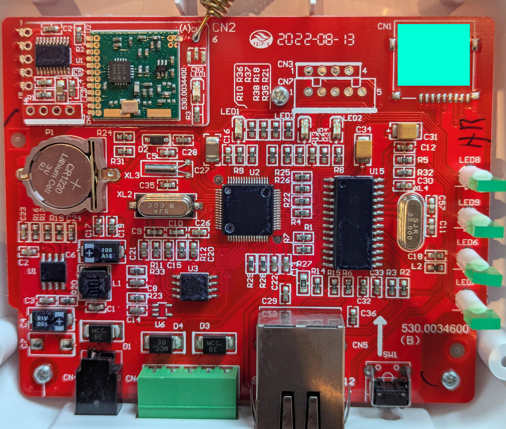
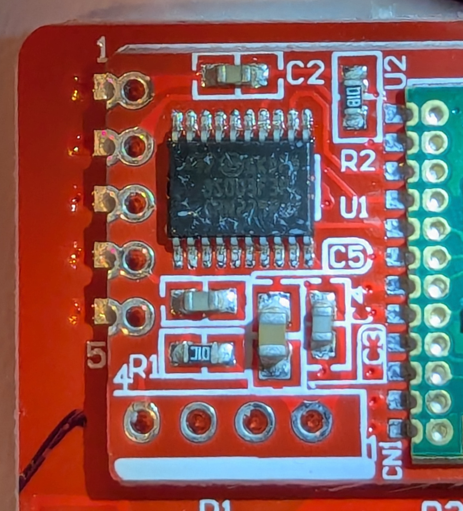

## ShineLink

ShineLink is an apparently deprecated Growatt inverter monitoring standard.

ShineLink-X (modbus over usb?) or ShineLink-S (modbus over serial?) connect to the inverter,
transmit data, and a ShineLanBox receives(?) this data and uploads it to the cloud.

This is different to the ShineLan-X and the ShineWifi-S (and e.g. the 4g variants), as there
is a mysterious link between the ShineLanBox and the ShineLink.

Projects like [grott](https://github.com/johanmeijer/grott) interfere with the cloud communication.

Projects like [OpenInverterGateway](https://github.com/OpenInverterGateway/OpenInverterGateway) replace the firmware
on a ShineWifi-S.

### ShineLanBox

[fccid](https://fccid.io/2AAJ9-SHINELANBOX)

Reasonably strong evidence that this is a 433MHz ISM-band device.

Board photo:

Mystery QR code in an unpopulated chip position redacted.

U1 (power side): D9329 2063 - some buck regulator (odd as they have a 5V/1A barrel jack in)
U2: ?, guessing main MCU
U15 (ethernet side): ENC28J60-?/?? (83) 2231A?0 Microchip - SPI ethernet controller

### 433 daughterboard

daughterdaughterboard:
 * SI4432 BPS1K5 2141 - Si4432 revision B, [internal], 2021 week 41 
 * 6-pin chip labelled "100"
 * crystal labelled "JHF 30.000"

Visually very similar to the [G-NiceRF RF4432](docs/nicerf-4432.pdf)

daughterdaughterboard would hence be SDO/SDI/SCLK/nSEL (pins 6/7/8/9) (or gpio on 2/3/4)?
Pin 1 is opposite the antenna, at the top of the board, pin 12 at the bottom left.
1, 12, 13: gnd, 5: 3.3V, 10: interupt, 11: shutdown, 14: antenna.

Unable to read other chip:

Nor guess why it exists. Presumably the whole board runs at 3.3V.

Central microcontroller must have a spare serial interface. Only appears to have passive supports.

Appears to be connected to the GPIO (pin 3 track is clear),
and the serial lines go somewhere (throughole).

Don't recognise the `530.0034400` marking. LED isn't exposed outside th ecase.
